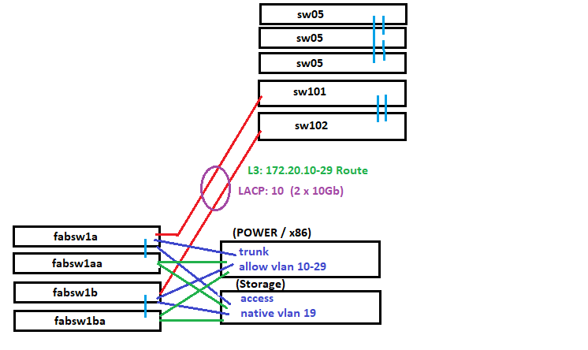

# Arrow Solutions Lab - IBM Island - Alpharetta Georgia #


**This GitHub Repository is a consolidation of documenation as well as documentation on deployment of the Arrow Solution Center Lab IBM Island**

**We will perform the following tasks**

* Deploy Networking switching
* Deploy Fibre Channel SAN switching
* Take POWER systems and deploy tasks via IaC
* Deploy IBM SAN storage to hosts via IaC
* Deployment of RedHat Openshift Clusters both x86 and POWER for demos

## Prerequisites -  Linux host running Ansible Automation Platform outside the environment but access to all infrastructure##

**contacts**
Name | eMail | Domain
------------ | -------------
Tony Owens | toowens@arrow.com | SAN and Storage
Don Knall | dknall@arrow.com | POWER Systems


First Header | Second Header
------------ | -------------
Content from cell 1 | Content from cell 2
Content in the first column | Content in the second column


* This repository is private at git: https://github.com/aessatl/ibm_aessatl_arrow_com

## Section 1 - Deployment Strategy 

**1.1 - Networking Infrastructure**



* Primary playbook network_deploy.yml

```cisco switches <<Legacy>>
blah
```

**1.2 - IBM Storage**

* Primary playbook storage_deploy.yml

```flash

```

**This script is used to pull down and install all the necessary software we will need for the lab namely:**

* **Chocolatey** - Windows based package manager used to install and manage software - https://chocolatey.org/
* **Git commandline**  - used to interact with git repos - https://community.chocolatey.org/packages/git
* **Packer** - image build manager used to create artifacts for server and infrastructrue builds expressed as code - https://community.chocolatey.org/packages/packer
* **Terraform** - Used to orchestrate the provisioning of infrastrcutre expressed as code - https://community.chocolatey.org/packages/terraform
* **Azure CLI** - azure command line tool that allows commands against Azure cloud - https://community.chocolatey.org/packages/azure-cli

<br/>

**1.3 - Change into a directory that you want to clone the repo into ie...**
```powershell
cd "~/desktop"
```
